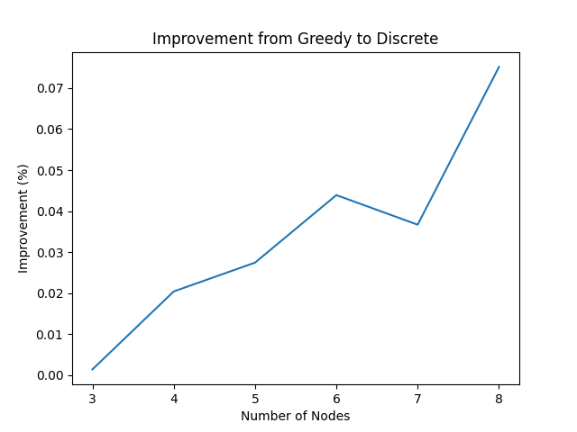

# 🚦 TrafficTSP

## 🧠 Overview  
**TrafficTSP** is a simulation and optimisation project that aims to demonstrate various of my skills, including Python, SQL, CI/CD, Mixed-Integer Linear Programming, and the integration of Machine Learning. It also demonstrates creativity to formulate problems, propose solutions, and compare them.

## 🚗 Project Description  
TrafficTSP tackles a variant of the **Travelling Salesman Problem (TSP)**, in which travel times between nodes change based on the time of day, simulating real-world traffic conditions. The goal is to find efficient routing strategies under these constraints.

## ✨ Key Features

- **TSP Instance Generator**: 
  Simulates routing problems on dynamic graphs with edge weights that depend on the time of the day.
- **Optimisation Strategies**:
  - Greedy heuristic approach.
  - Discretisation-based strategy using time bins.
- **Evaluation Tools**: Visual and quantitative comparisons of computational time and solution quality.
- **ML-Based Optimisation (Planned)**  
  - Use of machine learning to select optimal bin sizes for discretisation  


## 🛠 Technologies Used

| Area            | Tools                                 |
|-----------------|----------------------------------------|
| Language        | Python                                 |
| Optimisation    | OR-TOOLS (Mixed-Integer Linear Programming) |
| Database        | SQL                                    |
| CI/CD & Testing | GitHub Actions, Pytest                 |


## 🚀 Installation

1. **Clone the repository**  
   ```bash
   git clone https://github.com/yourusername/TrafficTSP.git
   cd TrafficTSP
   ```

2. **Create a virtual environment**  
   ```bash
   python -m venv venv
   source venv/bin/activate  # For Linux/macOS
   venv\Scripts\activate     # For Windows
   ```

3. **Install dependencies**  
   ```bash
   pip install -r requirements.txt
   ```

## ▶️ Usage

To run the simulation and compare algorithms on graphs with less than 9 nodes over 2 runs:

```bash
python main.py --nodes 9 --n_repetitions 2
```

You can adjust `--n_repetitions` to reduce runtime or increase statistical robustness.

## 📊 Output

The tool generates visual comparisons between optimisation strategies:

**Example Performance Comparison**  


**Improvement over Greedy Strategy**  


> These figures illustrate how the discretisation approach can outperform the greedy baseline under traffic-based constraints.

## ⚠️ Known Limitations

- Travel cost functions may become unstable beyond a certain range in `create_random_weight_function()`.
- The generated graphs are not guaranteed to satisfy the triangle inequality.
- The greedy solver assumes connected graphs; results may be undefined otherwise.
- The discrete solver will be UNSAT if the optimal solution requires more minutes than `max?time`.
